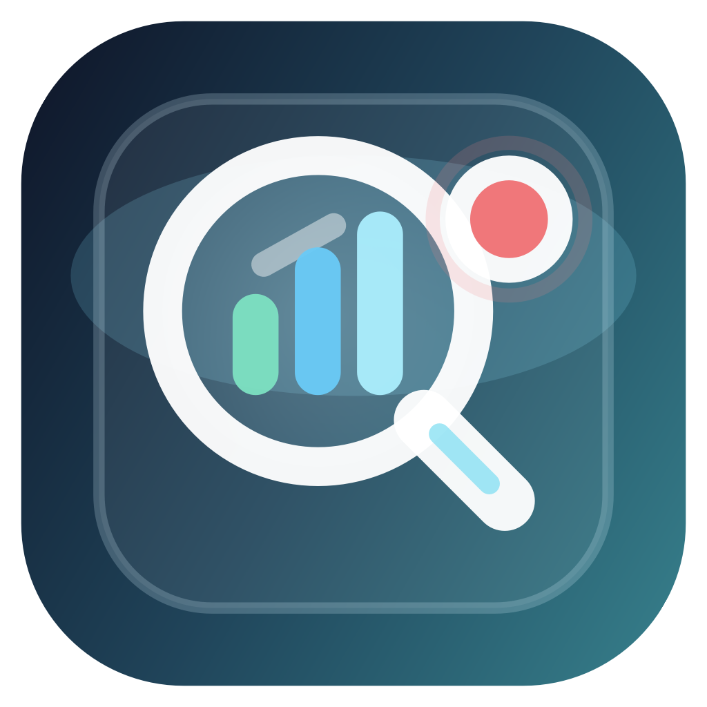
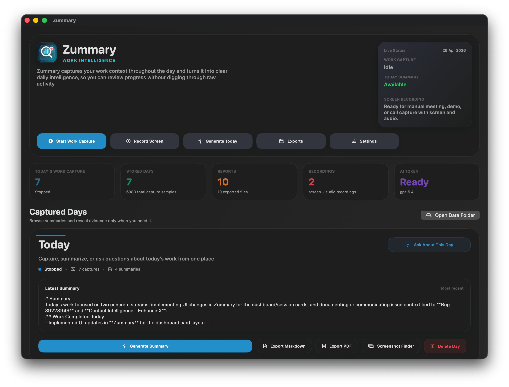
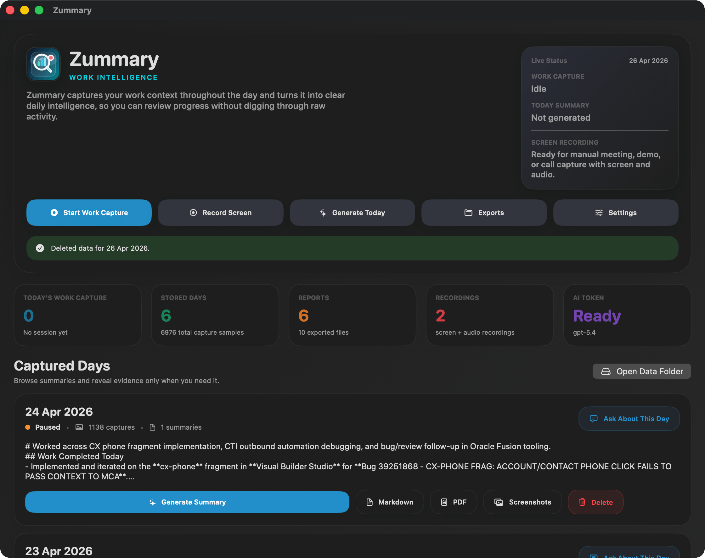
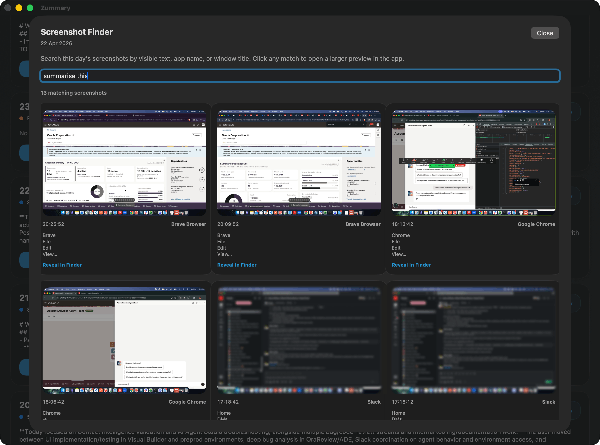
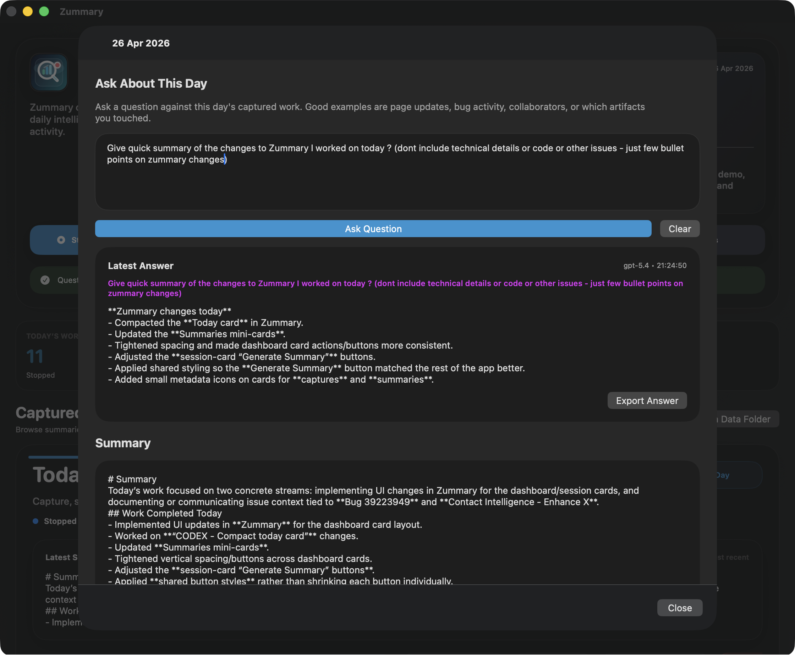
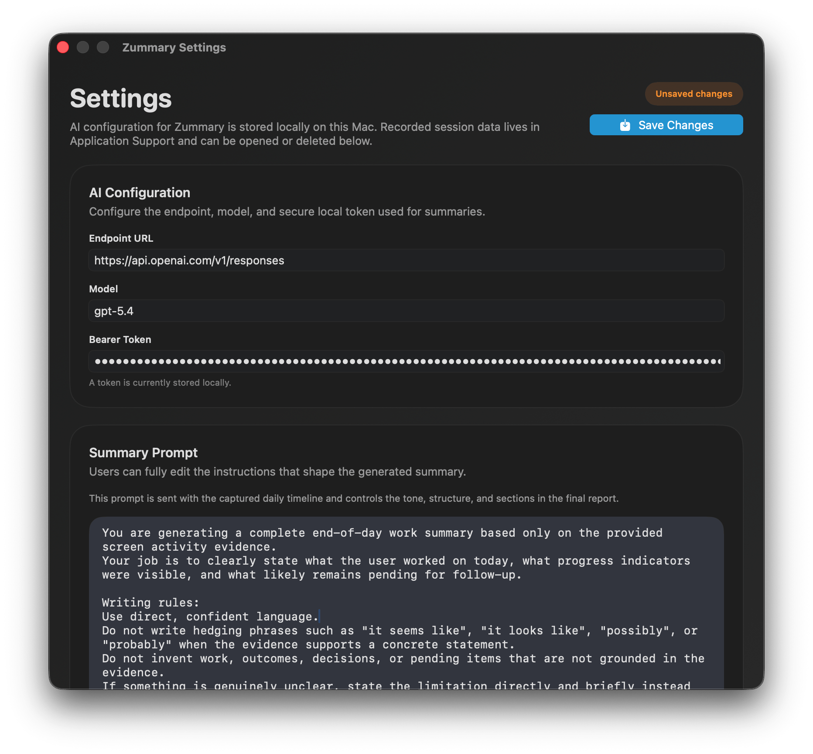

#  Zummary

**Work intelligence for your day.**

Zummary is a native macOS app that quietly captures work context during the day, turns it into structured AI summaries, and exports polished end-of-day reports. It is built for people who want a reliable view of what they worked on, what changed, and what is still pending.

  

## Why Zummary

Zummary helps turn scattered work activity into a useful daily narrative:

- **Capture what you worked on** with timed OCR-based work capture.
- **Generate clear daily summaries** from the captured timeline.
- **Ask follow-up questions about a day** using the same captured evidence.
- **Keep manual screen recordings separate** for calls, demos, or walkthroughs.
- **Export your day** as Markdown and PDF.
- **Store data locally on your Mac** with configurable retention and AI settings.

## What It Does

### Work Capture
- Periodically captures screenshots of your active work.
- Runs OCR on captured screenshots.
- Tracks app and window context to make summaries more meaningful.
- Lets you start and stop capture from the dashboard or menu bar.

### AI Summary Generation
- Builds a day summary from captured evidence.
- Uses a configurable model, endpoint, and bearer token.
- Supports a fully editable system prompt.
- Focuses on completed work, concrete activity, and pending follow-ups.
- Saves each generated summary into a date-grouped folder.
- Uses evidence filtering so passive on-screen content is less likely to be treated as completed work.

### Ask About This Day
- Lets you ask focused follow-up questions against one day’s captured evidence.
- Works with or without an existing generated summary.
- Answers can be exported as Markdown.
- Useful for questions like:
  - which bugs or tickets you touched
  - what pages or artifacts you edited
  - what changed during the day

### Screenshot Search
- Search a single day’s captured screenshots by:
  - visible OCR text
  - app name
  - window title
- Opens matching screenshots in an in-app preview.
- Lets you reveal the underlying screenshot file in Finder.

### Screen Recording
- Separate from OCR work capture.
- Records screen plus audio for meetings, demos, or walkthroughs.
- Saves recordings into date-grouped folders.
- Optimized for smaller output size than full-resolution raw capture.
- Excludes Zummary’s own app windows from its screen recordings.

### Exports
- Export generated summaries as:
  - **Markdown**
  - **PDF**
- Opens exported files directly in Finder for quick access.

### Settings and Data Management
- Configure capture interval.
- Configure retention period.
- Edit AI prompt and model settings.
- View app storage locations.
- Open, clean, or reset recorded data.
- Save generated summaries into their own date-grouped summaries folder.

## Feature Highlights

- **Focused dashboard** with live status, capture controls, summaries, exports, and recent activity in one place.
- **Ask About This Day** for grounded follow-up answers against captured evidence.
- **Screenshot Finder** to search captured screenshots by text and context.
- **Dedicated screen recording** that stays separate from OCR summary capture.
- **Configurable AI + capture settings** for prompt, model, interval, retention, and data management.

## Screenshot Gallery

<table>
  <tr>
    <td width="50%">
      
    </td>
    <td width="50%">
      
    </td>
  </tr>
  <tr>
    <td width="50%">
      
    </td>
    <td width="50%">
      
    </td>
  </tr>
</table>

## Notes

- Zummary stores app data under `~/Library/Application Support/Zummary`.
- Screen recordings and OCR work capture are intentionally separate flows.
- The app uses macOS permissions for screen capture, microphone, and accessibility where needed.
- Accessibility access is used to read the focused window title and improve work-context classification.
- Generated summaries, exports, screenshots, and recordings are stored in separate date-grouped folders.

# Download
The app is available to download for Mac. The file 'Zummary.app' can be downloaded from releases tab.